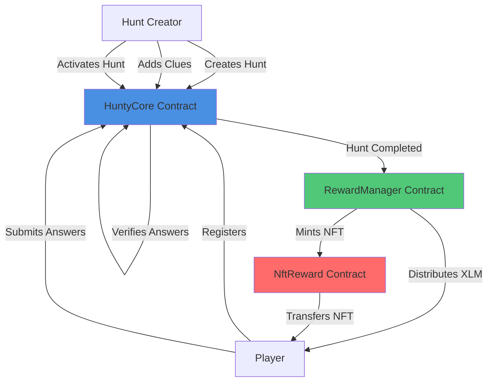
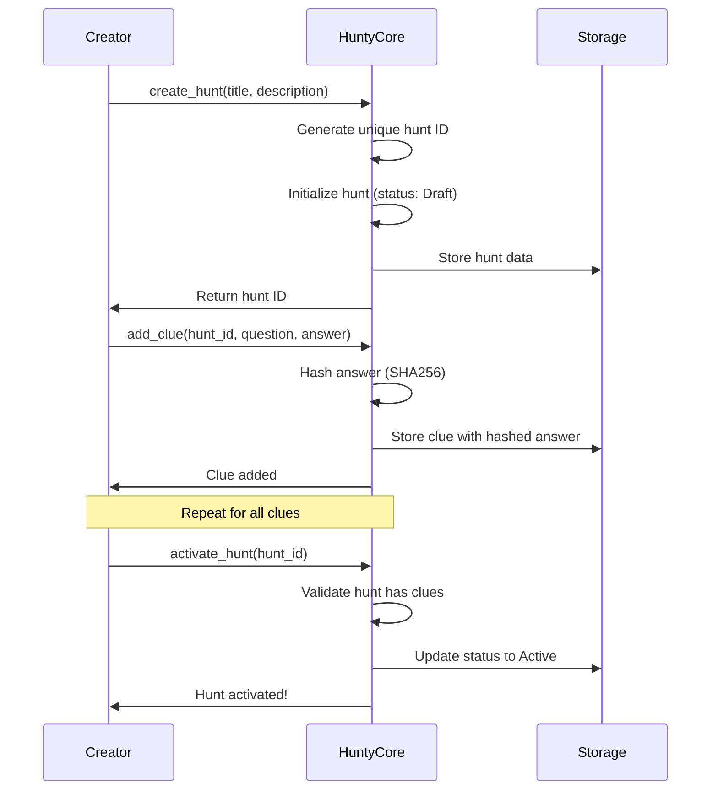
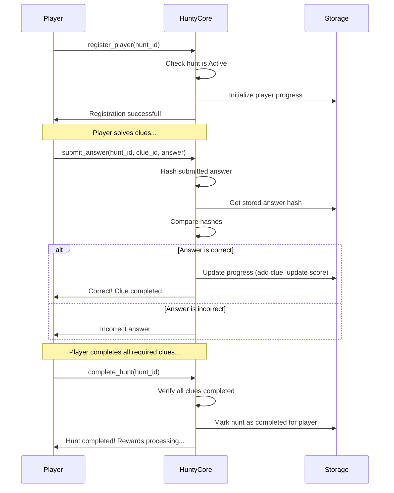
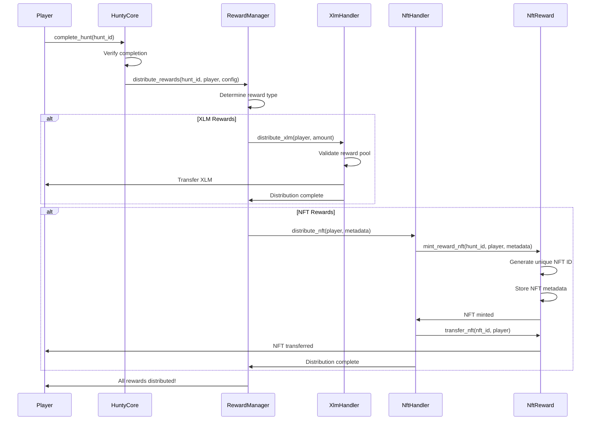
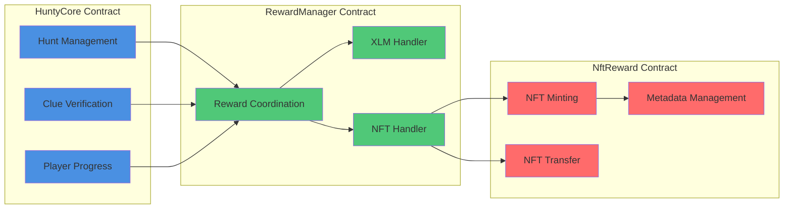
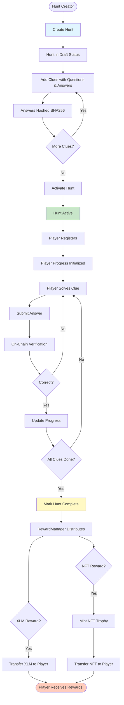

# Hunty - Decentralized Scavenger Hunt Game

[](LICENSE)
[](https://www.rust-lang.org/)
[](https://soroban.stellar.org/)

Hunty is a decentralized scavenger hunt game built on Stellar/Soroban. Create thrilling scavenger hunts with multiple clues and challenges, engage players in immersive treasure hunts, and reward them with XLM tokens or exclusive NFTs.

## What is Hunty?

Imagine a treasure hunt where every clue is verified on the blockchain, every answer is secure, and every completion is rewarded with real value. That's Hunty.

Hunty transforms the classic scavenger hunt into a decentralized gaming experience. Hunt creators design custom challenges with multiple clues, each leading players closer to completion. Players race to solve clues, with their progress tracked transparently on-chain. When they complete all clues, they're rewarded with XLM tokens or unique NFTs that commemorate their achievement.

The beauty of Hunty lies in its simplicity and security. Answers are hashed on-chain, so no one can cheat by looking at the contract. Multiple hunts can run simultaneously, and players can participate in as many as they want. The entire system is trustless, transparent, and built on Stellar's fast, low-cost blockchain.

## Game Overview

### The Big Picture

Hunty operates as a three-contract system where each contract has a specific role:

1. **HuntyCore** - The game master that manages hunts, verifies answers, and tracks progress
2. **RewardManager** - The treasurer that coordinates and distributes rewards
3. **NftReward** - The mint that creates unique NFT trophies for completing players

Here's how they work together:



### How It Works

#### Creating a Hunt

Anyone can become a hunt creator. Here's what happens when you create a hunt:



**Key Points:**
- Hunts start in "Draft" status, so you can add clues before going live
- Answers are hashed using SHA256 before storage - this keeps them secret until someone solves them
- Only the creator can add clues and activate the hunt
- Once active, players can register and start playing

#### Playing a Hunt

The player experience is straightforward but exciting:



**Key Points:**
- Players can register for any active hunt
- Answers are verified on-chain by comparing hashes
- Progress is tracked transparently - you can see which clues you've completed
- Case-insensitive matching means "Paris" and "paris" both work
- Once all required clues are solved, the hunt is marked complete

#### Reward Distribution

This is where it gets exciting - players get rewarded for their efforts:



**Key Points:**
- Rewards can be XLM tokens, NFTs, or both
- XLM is transferred directly to the player's wallet
- NFTs are minted on-demand and include hunt completion details
- Each NFT is unique and serves as a collectible trophy
- The entire process is automated and trustless

### System Architecture

Here's how the three contracts interact:



### Complete Game Flow

Here's the entire journey from hunt creation to reward distribution:



## Features

- 🎯 **Customizable Challenges**: Create unique scavenger hunts with a series of clues and tasks
- 🏆 **Reward System**: Offer significant rewards including XLM tokens and exclusive NFTs
- 👥 **Interactive & Social**: Encourage collaboration and competition among players
- 🔒 **On-Chain Verification**: All clue answers verified on-chain for security
- 🎮 **User-Friendly**: Easy-to-use game creation tools
- ⚡ **Stellar Integration**: Built on Stellar blockchain for fast, low-cost transactions
- 🔐 **Secure**: Answers are hashed, preventing cheating and answer disclosure
- 🎨 **Unique NFTs**: Each completion generates a unique NFT trophy
- 📊 **Transparent**: All progress and completions are publicly verifiable
- 🚀 **Scalable**: Multiple hunts can run simultaneously

## Architecture

Hunty consists of three main smart contracts:

1. **HuntyCore** - Main game logic, hunt management, and clue verification
2. **RewardManager** - Coordinates reward distribution (XLM and NFT)
3. **NftReward** - Handles NFT minting and transfer for completion rewards

### Contract Responsibilities

**HuntyCore Contract:**
- Manages the entire hunt lifecycle (creation, activation, completion)
- Stores and verifies clue answers using cryptographic hashes
- Tracks player progress and scores
- Coordinates with RewardManager when hunts are completed
- Provides query functions for hunt information and leaderboards

**RewardManager Contract:**
- Receives completion notifications from HuntyCore
- Determines reward type (XLM, NFT, or both)
- Manages reward pools and validates sufficient funds
- Routes to appropriate handlers (XLM or NFT)
- Tracks reward distribution status

**NftReward Contract:**
- Mints unique NFTs when players complete hunts
- Stores NFT metadata including hunt information
- Manages NFT ownership and transfers
- Provides query functions for NFT information

## Quick Start

### Prerequisites

- [Rust](https://www.rust-lang.org/tools/install) (latest stable version)
- [Stellar CLI](https://soroban.stellar.org/docs/getting-started/setup)
- Git

### Installation

```bash
# Clone the repository
git clone https://github.com/Samuel1-ona/Hunty-contract.git
cd Hunty-contract

# Build all contracts
cd contracts/hunty-core && make build
cd ../reward-manager && make build
cd ../nft-reward && make build
```

### Running Tests

```bash
# Test individual contracts
cd contracts/hunty-core && make test
cd ../reward-manager && make test
cd ../nft-reward && make test

# Or test all contracts from root
cargo test --workspace
```

## Project Structure

```
hunty-contract/
├── contracts/
│   ├── hunty-core/          # Main game logic
│   │   ├── src/
│   │   │   ├── lib.rs       # Main contract implementation
│   │   │   ├── types.rs     # Data structures
│   │   │   ├── storage.rs   # Storage access patterns
│   │   │   ├── errors.rs    # Error types
│   │   │   └── test.rs      # Tests
│   │   └── Cargo.toml
│   ├── reward-manager/      # Reward distribution
│   │   ├── src/
│   │   │   ├── lib.rs       # Main contract
│   │   │   ├── xlm_handler.rs
│   │   │   ├── nft_handler.rs
│   │   │   └── test.rs
│   │   └── Cargo.toml
│   └── nft-reward/          # NFT rewards
│       ├── src/
│       │   ├── lib.rs
│       │   └── test.rs
│       └── Cargo.toml
├── CONTRIBUTING.md          # Contribution guidelines
├── DEVELOPMENT.md          # Development guide
├── GITHUB_ISSUES.md         # List of issues for developers
├── Cargo.toml               # Workspace configuration
└── README.md
```

## Development

### Getting Started

See [DEVELOPMENT.md](DEVELOPMENT.md) for detailed development setup and workflow.

### Contributing

We welcome contributions! Please see [CONTRIBUTING.md](CONTRIBUTING.md) for guidelines.


## Use Cases

### For Hunt Creators

- **Educational Institutions**: Create learning hunts that teach students about history, science, or geography
- **Event Organizers**: Design location-based hunts for conferences, festivals, or community events
- **Content Creators**: Engage audiences with interactive challenges and reward participation
- **Businesses**: Run marketing campaigns with scavenger hunts that reward customers
- **Non-Profits**: Create awareness campaigns with gamified experiences

### For Players

- **Gamers**: Compete in multiple hunts, build a collection of NFT trophies, and earn XLM
- **Learners**: Participate in educational hunts that make learning fun and rewarding
- **Explorers**: Discover new places and information through location-based challenges
- **Collectors**: Build a unique collection of completion NFTs
- **Competitors**: Climb leaderboards and compete for top scores

## Security Features

- **Answer Hashing**: All answers are hashed using SHA256 before storage, preventing answer disclosure
- **On-Chain Verification**: Every answer is verified on-chain, making cheating impossible
- **Access Control**: Only hunt creators can modify their hunts
- **Atomic Operations**: Reward distributions are atomic - either everything succeeds or nothing happens
- **Transparent Progress**: All progress is publicly verifiable on the blockchain
- **Secure Rewards**: Reward pools are validated before distribution to prevent over-spending

## Roadmap

### Phase 1: Core Functionality ✅ (In Progress)
- [x] Project structure setup
- [ ] Hunt creation and management
- [ ] Clue verification system
- [ ] Player progress tracking
- [ ] Basic reward distribution

### Phase 2: Reward System
- [ ] XLM token rewards
- [ ] NFT reward minting
- [ ] Reward pool management

### Phase 3: Advanced Features
- [ ] Multi-answer support
- [ ] Weighted scoring
- [ ] Time-based bonuses
- [ ] Leaderboards

### Phase 4: Enhancements
- [ ] Hunt templates
- [ ] Social features
- [ ] Analytics and statistics

## Documentation

- [Development Guide](DEVELOPMENT.md) - Setup and development workflow
- [Contributing Guidelines](CONTRIBUTING.md) - How to contribute


## License

This project is open source. See LICENSE file for details.

## Resources

- [Soroban Documentation](https://soroban.stellar.org/docs)
- [Stellar SDK Reference](https://docs.rs/soroban-sdk/)
- [Rust Book](https://doc.rust-lang.org/book/)

## Support

- Open an [issue](https://github.com/Samuel1-ona/Hunty-contract/issues) for bugs or feature requests
- Check documentation files for detailed information


## Acknowledgments

Built on [Stellar](https://www.stellar.org/) and [Soroban](https://soroban.stellar.org/).

---

**Note**: This project is in active development. The API may change as we iterate on the design.
